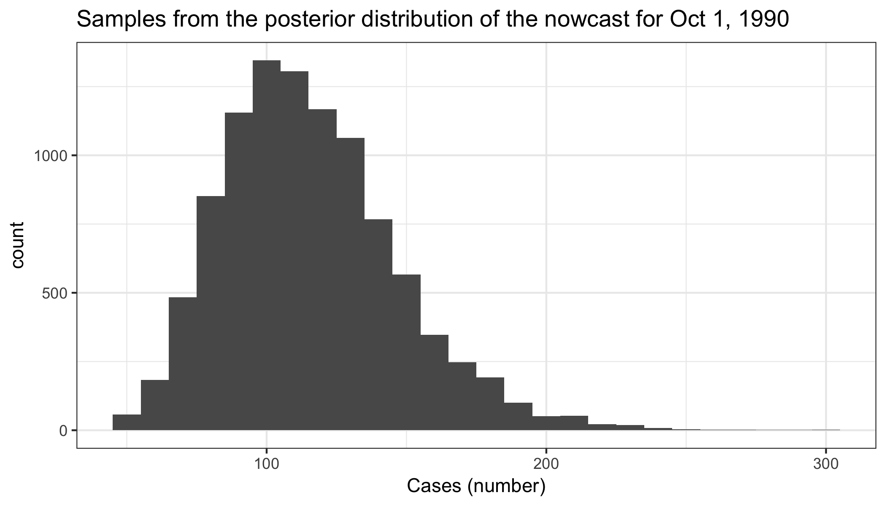
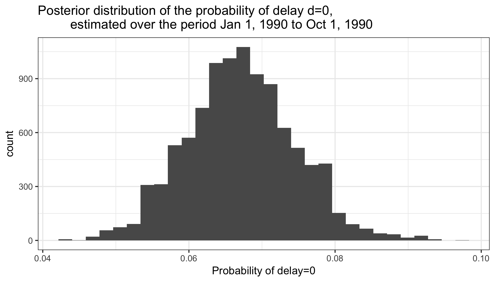

<!-- README.md is generated from README.Rmd. Please edit that file -->
NobBS: Nowcasting by Bayesian Smoothing
=======================================

<!-- badges: start -->
<!-- badges: end -->
NobBS is Bayesian approach to estimate the number of occurred-but-not-yet-reported cases from incomplete, time-stamped reporting data for disease outbreaks. NobBS learns the reporting delay distribution and the time evolution of the epidemic curve to produce smoothed nowcasts in both stable and time-varying case reporting settings.

Installation
------------

You can install the released version of NobBS from [CRAN](https://CRAN.R-project.org) with:

``` r
install.packages("NobBS")
```

The development version of NobBS can be installed with:

``` r
library(devtools) 
install_github("sarahhbellum/NobBS") 
```

NobBS **requires** that [JAGS](http://mcmc-jags.sourceforge.net/) (Just Another Gibbs Sampler) is downloaded to the system or computer on which NobBS will run. Download JAGS here: <http://mcmc-jags.sourceforge.net/>.

Usage
-----

NobBS accepts a line list of case onset and case reporting dates as the input data, and users are required to specify:

-   `now`: The date at which the nowcast is to be performed
-   `units`: The temporal unit of reporting, either "1 day" or "1 week"
-   `onset_date`: The `Date` column containing the date of case onset
-   `report_date`: The `Date` column containing the date of case report

For example, in the data `denguedat`, cases are reported on a weekly basis:

``` r
library(NobBS)
data(denguedat)
head(denguedat)
#>   onset_week report_week
#> 1 1990-01-01  1990-01-01
#> 2 1990-01-01  1990-01-01
#> 3 1990-01-01  1990-01-01
#> 4 1990-01-01  1990-01-08
#> 5 1990-01-01  1990-01-08
#> 6 1990-01-01  1990-01-15
```

For this dengue report line list, the user would specify `units`="1 week", `onset_date`="onset\_week", and `report_date`="report\_week" to produce a nowcast for the Date `now` of choice.

The user may optionally specify arguments such as:

-   `moving_window`: The numeric size of the moving window used in the estimation of cases. The default option is `NULL`, i.e. no moving window, to consider all possible historical dates
-   `max_D`: The numeric maximum delay D to consider in the estimation of cases, in the same units as `units`. For example, if cases are known to be 100% reported within the first 10 weeks, then it would be reasonable to set `max_D` = 9 weeks. Even if there are longer delays in the data, the delay probability for long delays would be modeled as *P**r*(*D**e**l**a**y* ≥ 9*w**e**e**k**s*). Note that it is not possible to set the maximum delay to be longer than what is possible to observe in the data (e.g. one cannot set `max_D`=15 in a 12-week time series). By default, `max_D` is set equal to either:
    -   the length of the reporting time series minus 1, e.g. if 27 weeks of reporting data are provided, `max_D`=26.
    -   the length of `moving_window`-1, if `moving_window` is specified.
-   `cutoff_D`: A logical argument (default: `TRUE`) indicating whether to ignore delays larger than `max_D`. For example, for a `moving_window` of 27 weeks and a `max_D` of 10 weeks, `cutoff_D = TRUE` would indicate that cases reported with an 11+ week delay would be ignored. Conversely, setting `cutoff_D=FALSE` would model delays longer than 10 weeks within the moving window as *P**r*(27*w**e**e**k**s* &gt; *D**e**l**a**y* ≥ 10*w**e**e**k**s*).
-   `proportion_reported`: A decimal between (0, 1\] indicating the expected proportion reported. Default=1, meaning that 100% of cases are expected to be eventually reported. However, this may not be the case in all disease settings; for example, if the disease contributes to a number of asymptomatic cases that will not lead to detection by the health system, or if severe under-reporting is expected during a large outbreak. In these cases, the nowcast estimates will be inflated by 1/`proportion_reported`.

### Bayesian parameters

The user may specify whether underlying cases occur as part of a Poisson or a Negative Binomial process (Default: Poisson), and may specify the priors on the log-linear model as described in [McGough et al. 2019](https://www.biorxiv.org/content/10.1101/663823v1.full), where default values are set to be weakly informative. In addition, arguments governing the JAGS model MCMC sampling may be specified: number of chains (`nChains`, default=1), number of samples (`nSamp`, default=10,000), number of iterations discarded as burn-in (`nBurnin`, default=1000), number of thinned iterations (`nThin`, default=1), and adaptation period (`nAdapt`, default=1000). The percentile of the prediction interval may be specified with `conf` (default = 0.95 for a 95% prediction interval).

For recommendations on priors and moving windows, see the *Materials and Methods* sub-section in [McGough et al. 2019](https://www.biorxiv.org/content/10.1101/663823v1.full) entitled "NobBS R package implementation and recommendations."

Model output
------------

Altogether, a simple model may be run by specifying only the required arguments:

`NobBS(denguedat, as.Date("1990-10-01"),units="1 week",onset_date="onset_week",report_date="report_week")`. The user should **save the output to an R object** because many levels of information are stored in the output.

``` r
test_nowcast <- NobBS(data=denguedat, now=as.Date("1990-10-01"),
                      units="1 week",onset_date="onset_week",report_date="report_week")
#> [1] "Computing a nowcast for  1990-10-01"
#> Compiling model graph
#>    Resolving undeclared variables
#>    Allocating nodes
#> Graph information:
#>    Observed stochastic nodes: 820
#>    Unobserved stochastic nodes: 822
#>    Total graph size: 5090
#> 
#> Initializing model
```

NobBS returns the list `test_nowcast`, which contains the following elements:

1.  `estimates`, accessed via `test_nowcast$estimates`. This is a 5-column data frame containing case estimates for each date in the historical time series through `now`, with corresponding date of case onset, lower and upper bounds of the prediction interval, and the number of cases for that onset date reported up to `now`.
2.  `estimates.inflated`, accessed via `test_nowcast$estimates.inflated`. This is a 5-column data frame containing case estimates for each date in the historical time series through `now`, *inflated by the proportion\_reported*, with corresponding date of case onset, lower and upper bounds of the prediction interval, and the number of cases for that onset date reported up to `now`.
3.  `nowcast.post.samples`, accessed via `test_nowcasts$nowcast.post.samples`. This is a vector of 10,000 samples from the posterior predictive distribution of the nowcast itself.
4.  `params.post`, accessed via `test_nowcast$params.post`. This is a data frame containing 10,000 posterior samples for all parameters of the Bayesian model, including *α*<sub>*t* = *n**o**w*</sub>, {*l**o**g*(*β*<sub>*d*</sub>),...,*l**o**g*(*β*<sub>*m**a**x**D*</sub>) }, *λ*<sub>*t*, *d*</sub>, and *τ*<sub>*α*</sub><sup>2</sup>. This data frame can get increasingly large as the length of the time series of available data increases, so the user can control which parameter's posterior samples are outputted in `specs$param_names` (Default: all). See NobBS help file for details of `specs`.

``` r
tail(test_nowcast$estimates)
#>    estimate lower upper onset_date n.reported
#> 35       48    44    53 1990-08-27         44
#> 36       59    55    65 1990-09-03         54
#> 37       45    40    52 1990-09-10         38
#> 38       90    81   101 1990-09-17         71
#> 39       80    65    99 1990-09-24         40
#> 40      113    66   187 1990-10-01         10
```

Plotting results
----------------

The NobBS output can be used in a variety of ways- for example, to inspect the posterior distribution of the nowcast estimate or to plot the nowcast and "hindcasts" (estimates produced for weeks in the past).

### Inspecting the posterior distribution of key parameters

Posterior of the nowcast:

``` r
library(ggplot2)
nowcast_posterior <- data.frame(sample_estimate=test_nowcast$nowcast.post.samps)
ggplot(nowcast_posterior, aes(sample_estimate)) + 
  geom_histogram(binwidth=10) + 
  theme_bw() + 
  xlab("Cases (number)") +
  ggtitle("Samples from the posterior distribution of the nowcast for Oct 1, 1990")
```



Posterior of *β*<sub>*d* = 0</sub> (the estimated probability of a case being reported with no delay):

``` r
library(ggplot2)
library(dplyr)
beta_0 <- data.frame(prob=exp(test_nowcast$params.post$`Beta 0`))
ggplot(beta_0, aes(prob)) + 
  geom_histogram() + 
  theme_bw() + 
  xlab("Probability of delay=0") +
  ggtitle("Posterior distribution of the probability of delay d=0,
         estimated over the period Jan 1, 1990 to Oct 1, 1990")
```



### Plotting the sequence of nowcast and hindcasts

``` r
nowcasts <- data.frame(test_nowcast$estimates)

ggplot(nowcasts) + geom_line(aes(onset_date,estimate,col="Nowcast estimate"),linetype="longdash") +
  geom_line(aes(onset_date,n.reported,col="Reported to date"),linetype="solid") +
  scale_colour_manual(name="",values=c("indianred3","black"))+
  theme_classic()+
  geom_ribbon(fill="indianred3",aes(x = onset_date,ymin=nowcasts$lower, 
                             ymax=nowcasts$upper),alpha=0.3)+
  xlab("Case onset date") + ylab("Estimated cases") +
  ggtitle("Observed and predicted number of cases \nat the week of nowcast (Oct 1990) and weeks prior")
```


